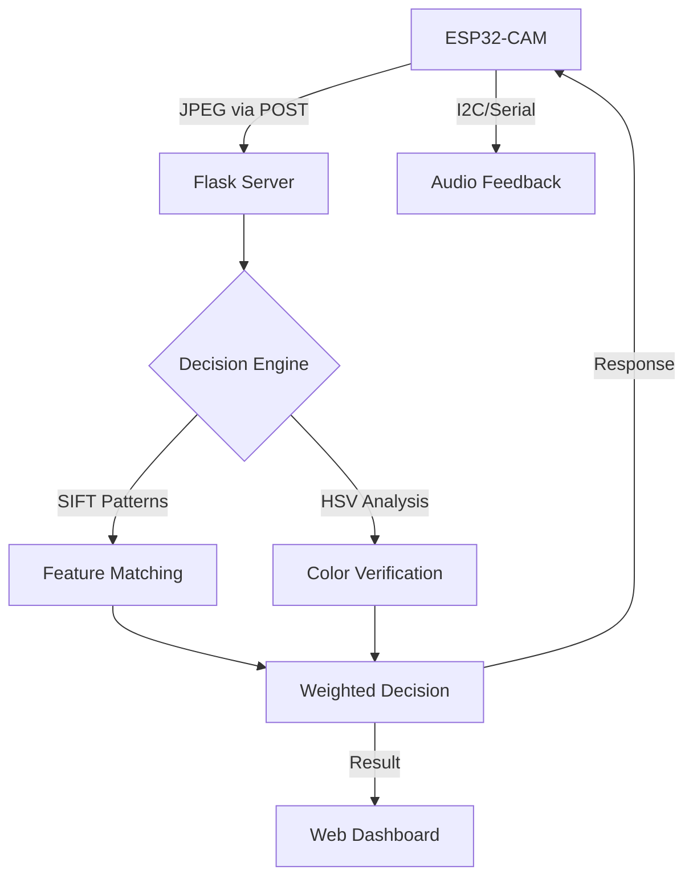

# 💵 Currency Recognition Hub (ESP32-CAM + SIFT)


A high-precision, low-latency currency identification system designed for the visually impaired. This project combines the portability of the **ESP32-CAM** with a powerful **SIFT (Scale-Invariant Feature Transform)** backend for reliable recognition of Indian Rupee (INR) notes.

---

## 🏗️ System Architecture



---

## ✨ Key Features

*   **🚀 Hybrid Recognition Engine**: Combines SIFT pattern matching (robust against rotation/scale) with HSV color verification (robust against lighting noise).
*   **📡 Real-time Dashboard**: Live camera monitor with detection history and confidence scoring.
*   **🛠️ Adaptive Enhancement**: Built-in "Gray World" white balance and CLAHE contrast enhancement to fix ESP32-CAM sensor tinting.
*   **🧪 Diagnostic Toolkit**: Includes local evaluation scripts (`eval_current.py`) and webcam-based testers for rapid debugging.

---

## 📂 Project Structure

*   `server.py`: The core Flask backend with SIFT/Color decision logic.
*   `Currency_Recognition_ESP32CAM/`: Arduino firmware for image capture and transmission.
*   `references/`: High-resolution master patterns for all currency denominations.
*   `captures/`: History of all processed recognition attempts.

---

## 🚀 Quick Start

### 1. Hardware Setup
*   Connect the **ESP32-CAM** to your local WiFi.
*   Ensure the **DFPlayer Mini** is wired for audio feedback (see `circuit_diagram.md`).

### 2. Server Installation
```bash
pip install flask opencv-python numpy
python3 server.py
```

### 3. Usage
*   Open the Dashboard: [http://localhost:5001](http://localhost:5001)
*   Open Webcam Tester: [http://localhost:5001/camera](http://localhost:5001/camera)

---

## 🔧 Troubleshooting & Performance

### ₹100 vs ₹500 Confusion
The system uses **Adaptive Saturation Logic** to distinguish between Lavender (100) and Stone Grey (500). If you experience misidentifications:
*   Ensure `references/ref_100.jpg` is a high-quality capture.
*   Check the "Decision Debug" logs in the server terminal for Hue/Saturation values.

### Known Issues
*   ⚠️ **ref_2000.jpg**: Currently a placeholder. Replace with a valid 2000 INR obverse image for full support.
*   ⚠️ **Address in Use**: If the server fails to start, kill the previous process using `pkill -9 -f server.py`.

---
*Developed for AI-powered assistive technology.*
# Currency_Recognition_Hub
