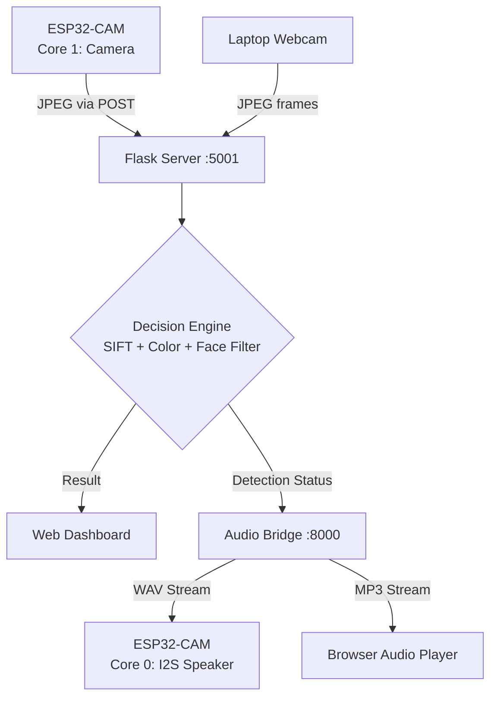

# 💵 Currency Recognition Hub (ESP32-CAM + SIFT + Audio)


A high-precision, low-latency currency identification system designed for the **visually impaired**. This project combines the ESP32-CAM with a powerful SIFT backend and a real-time audio announcement system that speaks the detected denomination aloud through an I2S speaker.

---

## 🏗️ System Architecture



---

## ✨ Key Features

- **🧠 Hybrid Recognition Engine** — Combines SIFT feature matching (rotation/scale invariant) with HSV color verification (lighting robust) for high accuracy.
- **👤 Face Detection Filter** — Uses Haar Cascade to detect human faces. If a face appears without a currency note, the system announces "Unknown" instead of misidentifying.
- **🗳️ Temporal Voting** — Results are stabilized over a rolling window of 7 frames. A denomination is only confirmed if it appears in 4+ consecutive frames, eliminating single-frame false positives.
- **🔊 Dual-Core Audio** — FreeRTOS pins the audio task to Core 0 of the ESP32-CAM. The speaker announces detected notes in real time, even when using the laptop webcam tester.
- **📡 Real-time Dashboard** — Live camera monitor, detection history, and confidence scoring at `http://<your-ip>:5001`.
- **🛠️ Adaptive Enhancement** — Gray World white balance + CLAHE contrast enhancement to correct ESP32-CAM sensor tinting.
- **🔈 Audio Test Panel** — Browser-based audio test panel at `http://<your-ip>:8000` with click-to-play buttons for every denomination.

---

## 📂 Project Structure

```
Currency_Recognition_Hub/
├── server.py                          # Core Flask backend (SIFT + Color + Face + Voting)
├── references/                        # High-res master images for SIFT training
│   ├── ref_10.jpg
│   ├── ref_20.jpg
│   ├── ref_50.jpg
│   ├── ref_100.jpg
│   ├── ref_200.jpg
│   └── ref_500.jpg
├── captures/                          # History of all processed recognition attempts
├── circuit_diagram.md                 # Hardware wiring guide
└── Currency_Recognition_ESP32CAM/
    └── Currency_Recognition_ESP32CAM.ino  # Unified dual-core ESP32-CAM firmware

../audio_server_project/               # Audio Bridge (separate repo)
├── audio_server.py                    # Bridge server: polls model → serves WAV to ESP32
├── audio_files/
│   ├── 10.wav / 10.mp3
│   ├── 20.wav / 20.mp3
│   ├── 50.wav / 50.mp3
│   ├── 100.wav / 100.mp3
│   ├── 200.wav / 200.mp3
│   ├── 500.wav / 500.mp3
│   ├── 2000.wav / 2000.mp3
│   └── unknown.wav / unknown.mp3
└── esp32_audio_streamer.ino           # Standalone audio-only firmware (legacy)
```

---

## 🚀 Quick Start

### 1. Hardware Required
| Component | Purpose |
|-----------|---------|
| ESP32-CAM (AI Thinker) | Camera capture + Audio playback |
| I2S Speaker module | Audio output |
| Wiring: BCLK→14, LRC→15, DIN→13 | I2S audio pins |

### 2. Install Dependencies
```bash
# Create a virtual environment (recommended)
python3 -m venv venv
source venv/bin/activate

# Install packages
pip install flask opencv-python numpy requests
```

### 3. Run the Servers

**Terminal 1 — Currency Recognition Server (port 5001):**
```bash
cd Currency_Recognition_Hub
source venv/bin/activate
python3 server.py
```

**Terminal 2 — Audio Bridge Server (port 8000):**
```bash
cd audio_server_project
source ../Currency_Recognition_Hub/venv/bin/activate
python3 audio_server.py
```

### 4. Flash ESP32-CAM Firmware
1. Open `Currency_Recognition_ESP32CAM/Currency_Recognition_ESP32CAM.ino` in **Arduino IDE**
2. Update your Mac's IP in lines 20–21:
   ```cpp
   const char* recognizeUrl = "http://<YOUR_MAC_IP>:5001/recognize";
   const char* audioUrl     = "http://<YOUR_MAC_IP>:8000/poll_audio";
   ```
3. Upload to your ESP32-CAM board

> **Find your Mac's IP:** Run `ipconfig getifaddr en0` in Terminal

### 5. Access the System
| What | URL |
|------|-----|
| 📊 Currency Dashboard | `http://<YOUR_IP>:5001` |
| 📷 Webcam Live Tester | `http://<YOUR_IP>:5001/camera` |
| 🔊 Audio Test Panel | `http://<YOUR_IP>:8000` |
| 📡 Detection Status (JSON) | `http://<YOUR_IP>:8000/status` |

---

## 🎯 How the Decision Engine Works

```
Frame Input
    │
    ├─ Phase 1: White Balance (Gray World)
    ├─ Phase 1.5: Face Detection (Haar Cascade)
    │       └─ Face detected + no note shape → return "unknown"
    ├─ Phase 2: Note Localization (Contour + Shape Analysis)
    ├─ Phase 3: CLAHE Enhancement
    ├─ Phase 4: SIFT Feature Matching (Lowe's ratio 0.70)
    ├─ Phase 5: HSV Color Verification
    └─ Phase 6: Decision Fusion
            ├─ High Certainty: SIFT ≥ 40 matches + gap ≥ 8
            ├─ Medium Certainty: SIFT ≥ 20 + color agree + shape
            ├─ Color Fallback: density > 15% + shape + SIFT ≥ 8
            └─ Unknown: nothing qualifies
                    │
                    ▼
            Temporal Voting Buffer (7 frames)
            → Stable result requires 4/7 majority
```

---

## 🔧 Troubleshooting

### ESP32 can't connect to server
- Check your Mac's IP with `ipconfig getifaddr en0`
- Ensure ESP32 and Mac are on the **same WiFi network**
- Verify both servers are running: `lsof -i :5001` and `lsof -i :8000`

### Audio not playing on ESP32
- Verify I2S wiring: BCLK→Pin14, LRC→Pin15, DIN→Pin13
- Re-flash the firmware after any IP changes
- Check Serial Monitor (115200 baud) for `[Audio] Playback complete` logs

### ₹100 vs ₹200 misidentification
- Both notes are purple-toned; ensure `ref_100.jpg` is a clear obverse shot
- Check server terminal for `Decision Debug` logs — look at the confidence gap

### Known Issues
- ⚠️ **ref_2000.jpg** is a placeholder — replace with a real ₹2000 note image for full support
- ⚠️ **Address in Use**: If a server fails to start, run `pkill -9 -f server.py` or `pkill -9 -f audio_server.py`

---

*Developed for AI-powered assistive technology — helping the visually impaired identify Indian Rupee notes in real time.*
